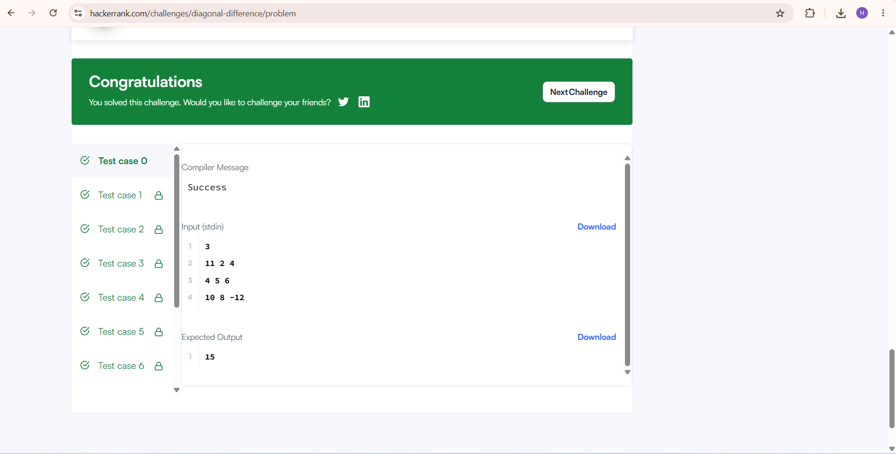
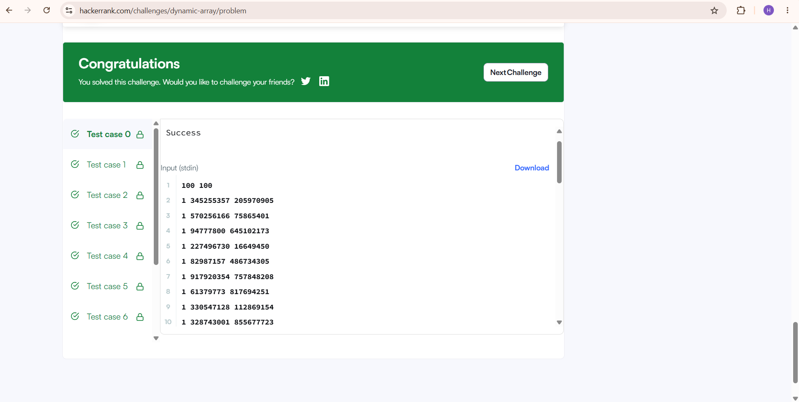
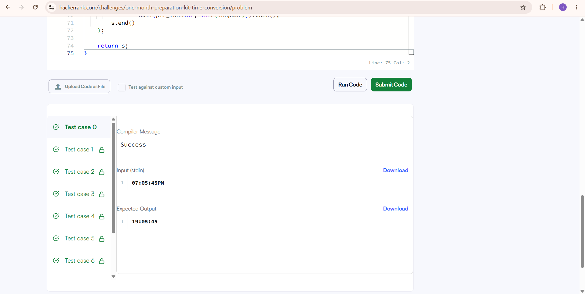

# HackerRank 3rd Semester Portfolio

## Course

Portfolio Building B25CS0311

## Activity

Activity 8: HackerRank Algorithmic Problem-Solving & Portfolio Integration

## Student Information

* **Semester:** 3rd Semester
* **Branch:** Computer Science & Engineering
* **Programming Language:** C++14
* **Platform:** HackerRank

---

## Problems Solved

1. Diagonal Difference
2. Dynamic Array
3. Time Conversion
4. Compare the Triplets
5. Sparse Arrays

---

## HackerRank Profile

[My HackerRank Profile](https://www.hackerrank.com/profile/nharshanayak97)

---

# 1. Diagonal Difference

## Description

Calculate the absolute difference between the sums of the primary diagonal and secondary diagonal of a square matrix.

## Approach

* Traverse the matrix once.
* Calculate the primary diagonal sum.
* Calculate the secondary diagonal sum.
* Find the absolute difference between the two sums.

## Complexity

* **Time Complexity:** O(N)
* **Space Complexity:** O(1)

## Source Code

[View diagonal_difference.cpp](Diagonal-Difference/diagonal_difference.cpp)

## HackerRank Result



---

# 2. Dynamic Array

## Description

Process a series of queries using dynamic sequences and the XOR operation to determine the required sequence.

## Approach

* Create `n` dynamic sequences.
* Calculate the sequence index using `(x ^ lastAnswer) % n`.
* For type 1 queries, add the value to the selected sequence.
* For type 2 queries, retrieve the required value.
* Update `lastAnswer` and store the result.

## Complexity

* **Time Complexity:** O(N + Q)
* **Space Complexity:** O(N)

## Source Code

[View dynamic_array.cpp](Dynamic-Array/dynamic_array.cpp)

## HackerRank Result



---

# 3. Time Conversion

## Description

Convert a time from 12-hour AM/PM format to 24-hour military time format.

## Approach

* Extract the hour from the input.
* Check whether the time is AM or PM.
* Convert `12 AM` to `00`.
* Add `12` to PM hours except `12 PM`.
* Keep the minutes and seconds unchanged.

## Complexity

* **Time Complexity:** O(1)
* **Space Complexity:** O(1)

## Source Code

[View time_conversion.cpp](Time-Conversion/time_conversion.cpp)

## HackerRank Result



---

# 4. Compare the Triplets

## Description

Compare Alice's and Bob's three ratings and calculate their respective scores.

## Approach

* Compare each corresponding value.
* Alice receives one point when her value is greater.
* Bob receives one point when his value is greater.
* Equal values give no points.
* Return both scores.

## Complexity

* **Time Complexity:** O(1)
* **Space Complexity:** O(1)

## Source Code

[View compare_the_Triplets.cpp](Compare-the-Triplets/compare_the_Triplets.cpp)

## HackerRank Result


---

# 5. Sparse Arrays

## Description

Count how many times each query string occurs in the given collection of strings.

## Approach

* Use an `unordered_map` to store the frequency of each string.
* Traverse the input strings and count their occurrences.
* Search for the frequency of each query string.
* Store and return the results.

## Complexity

* **Time Complexity:** O(N + Q) average-case
* **Space Complexity:** O(N)

## Source Code

[View sparse_arrays.cpp](Sparse-Arrays/sparse_arrays.cpp)

## HackerRank Result


---

# Complexity Analysis

| Problem              | Time Complexity | Space Complexity |
| -------------------- | --------------- | ---------------- |
| Diagonal Difference  | O(N)            | O(1)             |
| Dynamic Array        | O(N + Q)        | O(N)             |
| Time Conversion      | O(1)            | O(1)             |
| Compare the Triplets | O(1)            | O(1)             |
| Sparse Arrays        | O(N + Q)        | O(N)             |

---

# Skills Demonstrated

* C++
* C++14
* Arrays
* 2D Arrays
* Matrix Traversal
* Vectors
* Dynamic Arrays
* Strings
* Hash Maps
* `unordered_map`
* XOR
* Algorithmic Complexity
* Time Complexity
* Space Complexity
* Problem Solving
* HackerRank
* Git
* GitHub

---

# Repository Structure

```text
HackerRank-Portfolio/
│
├── Compare-the-Triplets/
│   ├── 04-compare-triplets.png
│   └── compare_the_Triplets.cpp
│
├── Diagonal-Difference/
│   ├── 01-diagonal-difference-hackerrank.png
│   ├── 01-diagonal-difference.png
│   └── diagonal_difference.cpp
│
├── Dynamic-Array/
│   ├── 02-dynamic-array.png
│   └── dynamic_array.cpp
│
├── Sparse-Arrays/
│   ├── 05-sparse-arrays.png
│   └── sparse_arrays.cpp
│
├── Time-Conversion/
│   ├── 03-time-conversion.png
│   └── time_conversion.cpp
│
└── README.md
```

---

# Learning Outcomes

Through this activity, I practiced fundamental algorithmic problem-solving techniques using C++14.

The five HackerRank problems helped me understand:

* Matrix traversal
* Primary and secondary diagonals
* Dynamic arrays
* Vectors
* Bitwise XOR operations
* String manipulation
* Time conversion
* Element-wise comparison
* Hash maps
* Frequency counting
* Time complexity analysis
* Space complexity analysis

I also gained experience in testing solutions on HackerRank and maintaining programming solutions using Git and GitHub.

---

# Algorithmic Optimization

The solutions focus on efficient algorithms and suitable data structures.

For **Diagonal Difference**, both diagonal sums are calculated during a single traversal of the matrix.

For **Dynamic Array**, vectors are used to maintain multiple sequences efficiently.

For **Time Conversion**, the input has a fixed format, so only a constant number of operations are required.

For **Compare the Triplets**, only three corresponding values need to be compared.

For **Sparse Arrays**, an `unordered_map` is used to store string frequencies so that repeated searches through the complete input list can be avoided.

These solutions demonstrate the importance of selecting appropriate data structures and considering time and space complexity while solving programming problems.

---

# Verification

The solutions were:

* Written in C++14
* Tested in Visual Studio Code
* Submitted on HackerRank
* Tested using HackerRank test cases
* Organized into separate problem folders
* Documented with time and space complexity
* Supported by HackerRank result screenshots
* Prepared for GitHub portfolio integration

---

# GitHub Repository

[HackerRank-Portfolio](https://github.com/nharshanayak97-ctrl/HackerRank-Portfolio)

---

# HackerRank Profile

[nharshanayak97](https://www.hackerrank.com/profile/nharshanayak97)

---

# Conclusion

This activity helped me improve my algorithmic problem-solving skills using C++14. I practiced arrays, matrices, vectors, strings, hash maps, XOR operations, and basic data structures.

I also learned how to analyze time and space complexity, test solutions on HackerRank, and maintain programming solutions in a GitHub portfolio.
